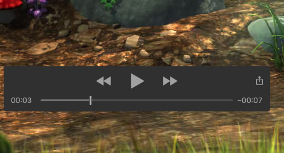

# Spec: UI Requirements

## UI

The window should be able to be resized. The ability to make a video window full-screen is not required but is a _nice-to-have_.

### Playback UI controls

We would prefer to have controls that mimic those found in Apple's AVKit. The controls appear when a mouse is moved in the video window. They disappear when the window loses focus, the mouse leaves the window or the video window is clicked outside of the control's grey box.

[]

However, we will consider alternative UI representations, such as a permanant control bar at the bottom of the window. 

#### Required UI controls

The player window should, at a minimum, include the following UI controls:

- Play/pause button. 
- A scrubber (aka slider) that allows users to scrub through the video to an arbitrary point in the video.
- Display of current elapsed time (hh:mm:ss)
- Display of total time of video

#### Additional UI Controls

- Fast-forward button
- Rewind button
- Clicking on the total time textfield toggles the to display the time remaining. Clicking again reverts to total time.

### Bounding box localization

A _bounding box_ is a labeled and localized rectangular region at a partly moment in the video. At a minimum, each bounding box will consist of the following fields:

- UUID as the primary key. 
- x and y location in image coordinates (origin of 0,0 is upper left corner of video) as pixels. 
- width and height of bounding box in pixels.
- A label (String) that provides an id of the object this is localized.

Additional fields can be added as deemed nescessary.

The video player will display prexisting bounding boxes over the video at the correct frame. The player will allow users to specify a time window. Each bounding boxes will have a defined `elapsed_time`. A visual representation of the bounding box will be displayed from `elapsed_time - timewindow / 2.0` to `elapsed_time + timewindow / 2.0` over the video.

Each bounding box will be correctly scaled and translated from it's pixel coordinates to match the video as it is scaled. (e.g. when a window is resized)

The bounding box will be represented in a manner that indicates when it is at the correct frame vs. when it is generally within the timewidow.

Bounding box information will be recieved via UDP from an external application. When a new media is opened and ready to be played, the video application will send a request via UDP for the bounding boxes.

```
Placeholder for request message format
```


```
Placeholder for response message format
```

External applications can send a message via UDP specifying that zero to many bounding boxes are selected. 

